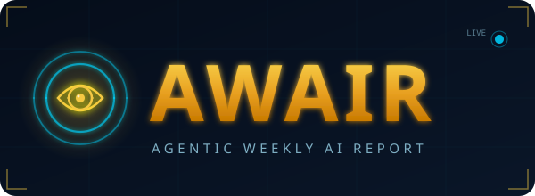

# AWAIR — Agentic Weekly Artificial Intelligence Report

<p align="center">
  
</p>

<p align="center">
  <a href="https://davidfliesen.github.io/AWAIR/">
    
  </a>
  &nbsp;
  
  &nbsp;
  
  &nbsp;
  
</p>

-----

> **AWAIR is the Agentic Weekly Artificial Intelligence Report** — a privacy-first, browser-based intelligence dashboard that helps AI practitioners, researchers, and enthusiasts track the people, companies, and trends shaping the future of artificial intelligence.

Configure a personal watchlist of key AI leaders, monitor curated sources ranging from company research blogs to academic preprint servers, and generate structured weekly briefings delivered on-screen or via email. All configuration and report history is stored exclusively in your browser’s local storage — no accounts, no servers, no tracking.

-----

## ✨ Features

- **📋 Configurable Watchlist** — Track key AI leaders by name, X (Twitter) handle, website, and YouTube channel. Assign priority tiers: Core, Watch, or Track.
- **🌐 Source Library** — Monitor company blogs, research feeds, newsletters, and news outlets. Toggle sources on/off at any time.
- **🏷 Keyword Signals** — Define custom topic keywords (e.g. “GPT-5”, “AI agents”, “multimodal”) that are scanned and flagged in every report.
- **📡 On-Demand Reports** — Run a full intelligence scan at any time with a single click. Reports render directly in the browser.
- **📅 Weekly Scheduling** — Configure which days of the week to auto-generate reports and at what time of day.
- **✉ Email Delivery** — Send your report to any email address via your local mail client, no SMTP configuration required.
- **🖨 Print-Ready** — Reports are formatted for clean printing or PDF export directly from the browser.
- **⬇ Export / Import** — Back up or transfer your full configuration as a portable JSON file.
- **🔒 100% Local Storage** — Zero data leaves your device. No accounts. No tracking. No third-party calls.

-----

## 🚀 Getting Started

AWAIR is a single-file HTML application. No build tools, no dependencies, no server required.

### ▶ Run in Browser (Live Demo)

**[→ Launch AWAIR](https://davidfliesen.github.io/AWAIR/)**

Open the link above to run AWAIR instantly — no installation needed.

-----

### Run Locally

```bash
git clone https://github.com/DavidFliesen/awair.git
cd awair
open awair-v001.html   # macOS
# or double-click awair-v001.html in Windows Explorer / Linux file manager
```

That’s it. The app runs entirely in your browser.

### Deploy to GitHub Pages

1. Fork this repository
1. Go to **Settings → Pages**
1. Set source to `main` branch, root directory
1. Your AWAIR instance will be live at `https://yourusername.github.io/AWAIR/`

-----

## 👁 Default Watchlist

AWAIR ships with a curated starting watchlist of the most influential voices in AI:

### 🔴 Core Watch — The AI Big 3

|Person            |Role                          |X Handle      |
|------------------|------------------------------|--------------|
|**Dario Amodei**  |CEO — Anthropic               |@darioadmodei |
|**Sam Altman**    |CEO — OpenAI                  |@sama         |
|**Kevin Weil**    |Chief Product Officer — OpenAI|@kevinweil    |
|**Demis Hassabis**|CEO — Google DeepMind         |@demishassabis|

### 🟡 Extended Watch

|Person             |Role           |X Handle     |
|-------------------|---------------|-------------|
|**Mark Zuckerberg**|CEO — Meta     |@zuck        |
|**Jensen Huang**   |CEO — NVIDIA   |@jensenhuang |
|**Satya Nadella**  |CEO — Microsoft|@satyanadella|

### 🟢 Tracking

|Person              |Role                              |X Handle        |
|--------------------|----------------------------------|----------------|
|**Yann LeCun**      |Chief AI Scientist — Meta         |@ylecun         |
|**Andrej Karpathy** |Independent AI Researcher         |@karpathy       |
|**Fei-Fei Li**      |Co-Founder — World Labs / Stanford|@drfeifei       |
|**Mustafa Suleyman**|CEO — Microsoft AI                |@mustafasuleyman|
|**Elon Musk / xAI** |CEO — xAI / Grok                  |@elonmusk       |

All people can be edited, removed, or supplemented from the **Watchlist** tab.

-----

## 🌐 Default Sources

AWAIR pre-loads 12 curated AI intelligence sources across five categories:

|Source                 |Category  |
|-----------------------|----------|
|The Rundown AI         |Newsletter|
|MIT Technology Review  |News      |
|Anthropic Blog         |Company   |
|OpenAI Blog            |Company   |
|Google DeepMind Blog   |Company   |
|Hugging Face Blog      |Company   |
|ArXiv AI Papers        |Research  |
|AI Snake Oil (Substack)|Newsletter|
|VentureBeat AI         |News      |
|The Decoder            |News      |
|Latent Space Podcast   |Newsletter|
|a16z AI                |News      |

Sources are fully configurable — toggle, remove, or add your own from the **Sources** tab.

-----

## 🏷 Default Keywords

```
GPT-5 · Claude · Gemini · AI agents · multimodal · reasoning models
open source AI · AI safety · AI regulation · robotics · diffusion models · LLM
```

Add any keyword from the **Watchlist** tab and it will be scanned in every report.

-----

## 🗂 App Structure

```
awair-v001.html        ← Complete single-file application (open to run)
README.md              ← This file
LICENSE                ← MIT License
assets/
  awair-logo.svg       ← Standalone logo asset (also used in this README)
```

-----

## 🔒 Privacy Architecture

AWAIR was designed from the ground up with user privacy as a core principle:

- **All data lives in `localStorage`** — watchlist, sources, keywords, settings, and report history are stored only in your browser on your device.
- **No external API calls** — the app makes zero network requests to any third-party service.
- **No analytics, no telemetry** — there is no usage tracking of any kind.
- **No account required** — there is no login, no registration, no email verification.
- **Portable config** — export your full configuration as a JSON file at any time from the Settings tab. Import it on any other device to restore your setup instantly.
- **Full reset** — the Settings tab includes a one-click option to wipe all local data and restore factory defaults.

> ⚠ **Note on scheduled email delivery:** AWAIR generates a `mailto:` link that opens your local mail client. It does not connect to any SMTP server directly. For fully automated email delivery, a lightweight local server or browser extension relay would be needed — see the Roadmap section below.

-----

## 🗺 Roadmap

Planned features for future versions:

- [ ] **v002** — RSS feed parsing for real-time source content (via CORS proxy or local server)
- [ ] **v003** — Live X/Twitter feed integration via API key (user-supplied, stored locally)
- [ ] **v004** — AI-powered report summarization using a user-configured LLM API key
- [ ] **v005** — SMTP email delivery with local credentials stored in `localStorage`
- [ ] **v006** — Report history archive with diff highlighting (“new since last week”)
- [ ] **v007** — Electron or PWA wrapper for true background scheduling
- [ ] **v008** — Dark/light theme toggle and custom accent colors
- [ ] **v009** — Multi-profile support (e.g. separate profiles for different focus areas)
- [ ] **v010** — Mobile-optimized layout

-----

## 🛠 Built With

- **Vanilla HTML / CSS / JavaScript** — zero framework dependencies
- **Google Fonts** — Rajdhani, Exo 2, JetBrains Mono
- **Browser localStorage API** — all persistence
- **CSS Custom Properties** — full theming system
- No npm. No build step. No bundler. Just open the file.

-----

## 📄 License

MIT License — free to use, modify, and distribute. See [`LICENSE`](LICENSE.md) for details.

-----

## 👤 About the Developer

**David Fliesen** is a Hybrid Generative AI Multimedia Developer based in Summerville, SC, with a background spanning 20+ years across multimedia production, U.S. Navy Combat Camera photojournalism, and pioneering DoD virtual agent work dating back to 2008. He recently completed the **Purdue Online / Simplilearn Applied Generative AI Specialization** and actively builds at the intersection of AI, creative media, and practical tooling.

David is the creator of the daily AI-generated comic strip **Sisters of Summerville** and develops a range of AI-powered prototypes including ComicsGen, InsightForge (an AI-powered talking BI dashboard), and AHA (an Agentic Healthcare Assistant).

|                        |                                                                                                    |
|------------------------|----------------------------------------------------------------------------------------------------|
|🌐 Portfolio             |[davidfliesen.github.io](https://davidfliesen.github.io)                                            |
|💼 LinkedIn              |[linkedin.com/in/fliesen](https://linkedin.com/in/fliesen/)                                         |
|🐙 GitHub                |[github.com/DavidFliesen](https://github.com/DavidFliesen)                                          |
|🎨 Sisters of Summerville|[sisters-of-summerville.github.io](https://sisters-of-summerville.github.io/Sisters-of-Summerville/)|

-----

<div align="center">
  <sub>AWAIR · Agentic Weekly AI Report · All data stored locally · No tracking · MIT License</sub>
</div>